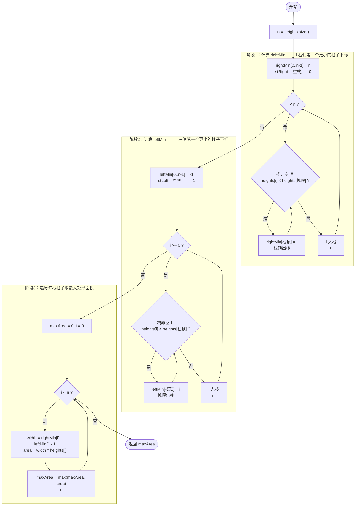

```mermaid
flowchart TD
    Start([开始]) --> InitN["n = heights.size()"]

    subgraph Phase1["阶段1：计算 rightMin —— i 右侧第一个更小的柱子下标"]
        direction TB
        R1["rightMin[0..n-1] = n<br/>stRight = 空栈, i = 0"]
        R2{"i < n ?"}
        R3{"栈非空 且<br/>heights[i] &lt; heights[栈顶] ?"}
        R4["rightMin[栈顶] = i<br/>栈顶出栈"]
        R5["i 入栈<br/>i++"]
        R1 --> R2
        R2 -- 是 --> R3
        R3 -- 是 --> R4
        R4 --> R3
        R3 -- 否 --> R5
        R5 --> R2
    end

    subgraph Phase2["阶段2：计算 leftMin —— i 左侧第一个更小的柱子下标"]
        direction TB
        L1["leftMin[0..n-1] = -1<br/>stLeft = 空栈, i = n-1"]
        L2{"i >= 0 ?"}
        L3{"栈非空 且<br/>heights[i] &lt; heights[栈顶] ?"}
        L4["leftMin[栈顶] = i<br/>栈顶出栈"]
        L5["i 入栈<br/>i--"]
        L1 --> L2
        L2 -- 是 --> L3
        L3 -- 是 --> L4
        L4 --> L3
        L3 -- 否 --> L5
        L5 --> L2
    end

    subgraph Phase3["阶段3：遍历每根柱子求最大矩形面积"]
        direction TB
        P1["maxArea = 0, i = 0"]
        P2{"i < n ?"}
        P3["width = rightMin[i] - leftMin[i] - 1<br/>area = width * heights[i]"]
        P4["maxArea = max(maxArea, area)<br/>i++"]
        P1 --> P2
        P2 -- 是 --> P3
        P3 --> P4
        P4 --> P2
    end

    InitN --> R1
    R2 -- 否 --> L1
    L2 -- 否 --> P1
    P2 -- 否 --> End([返回 maxArea])
```